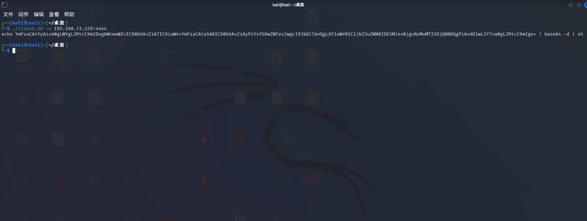
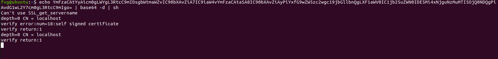
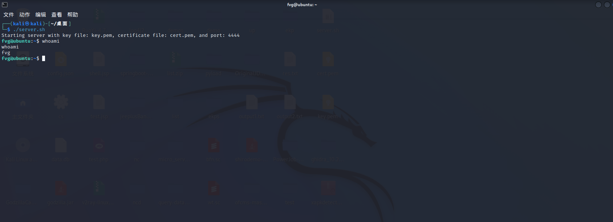
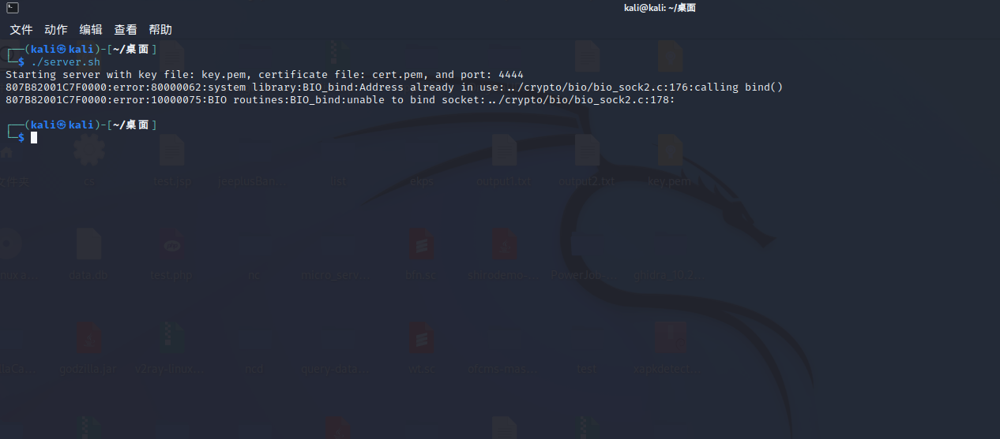

# SecShell

## 简介
在攻防演练时直接反弹shell后执行命令时会以明文形式传输，很容易被检测到，而利用openssl的单向认证可以对反弹shell后执行命令的流量进行加密。本工具对生成证书、监听端口等流程进行自动化集成，以提高工作效率。并且提供反弹shell命令生成脚本用于根据指定的IP和端口生成Base64加密的反弹shell命令。

## 免责声明
本工具仅用于研究与学习，请严格遵守当地法律法规，禁止使用本工具发起非法攻击等行为，基于非法攻击造成的后果由使用者负责。

## 使用方式
 

### 服务端
 

一键启动：默认生成证书，监听4444端口

    ./server.sh

 

或者指定证书，指定端口

 

    ./server.sh -k key.pem -c cert.pem -p 8888

 

生成反弹shell命令

    ./client.sh -s 192.168.73.129:4444

 

### 客户端
 

在客户端粘贴命令，反弹shell
 

### 最终效果
 
服务端接收到反弹回来的shell
 

### 常见问题
 

启动服务端时出现以下报错说明端口被占用，可选择其它端口，或者杀掉对应进程后再启动
